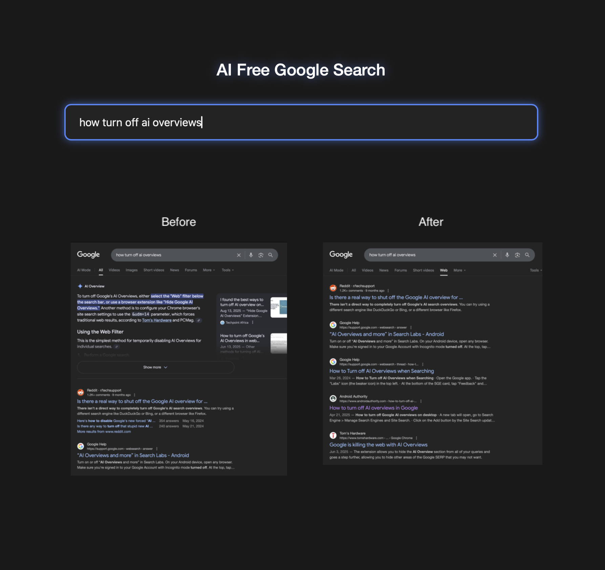

## AI-Free Google Search Page

This is a lightweight custom homepage for Safari (or any browser) that lets you search Google **without AI Overview** results.  
It works by appending the `&udm=14` parameter to all Google searches.

---

## Preview

---

## ✨ Purpose

Safari does not allow you to set a custom search engine URL template. This page acts as a workaround:

- Provides a single input field styled like a search homepage.
- On page load, the input field auto-focuses (even in Safari new windows).
- When you type a query and press **Enter**, the page redirects to:

https://www.google.com/search?q=<your-query>&udm=14

This ensures you always get a clean Google search without AI Overview.

---

## How it Works

- HTML + CSS for layout and styling (dark theme).
- A small JavaScript snippet:
  - Forces the search field to be focused on page load.
  - Captures the input on **Enter** and redirects to the AI-free Google URL.
- Uses CSS `clamp()` to make the search field responsive but capped between min/max widths.

---

## Usage Instructions

1. Save the HTML file (e.g. `ai-free-search.html`) locally on your Mac.
2. Open Safari.
3. Go to **Safari > Settings > General**.
4. Set **Homepage** to the local file path of your HTML page. Example:

file:///Users/path-to-ai-search-html-page/ai-free-search.html

(You can drag the file into Safari and copy the URL from the address bar.)

5. In the same General settings:

- Set **New windows open with** → _Homepage_.
- (Optional) Set **New tabs open with** → _Homepage_ as well.

Now, whenever you open a new Safari window (or tab, if configured), you’ll land on this AI-free search page with the input box ready for you to type.

---

## Notes

- Works offline since it’s just a local HTML file.
- Cross-browser compatible (tested in Safari, Chrome, Firefox).
- Easily customizable — you can tweak styles, colors, or the search engine URL if Google changes its parameters.
